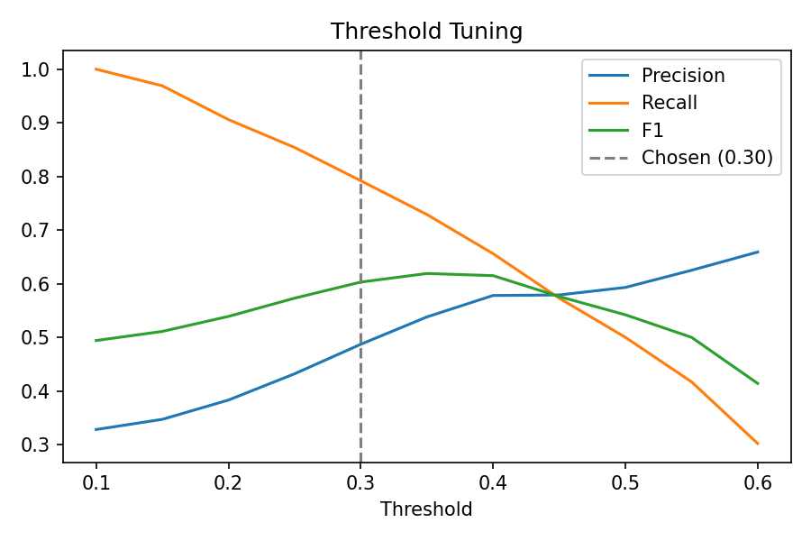
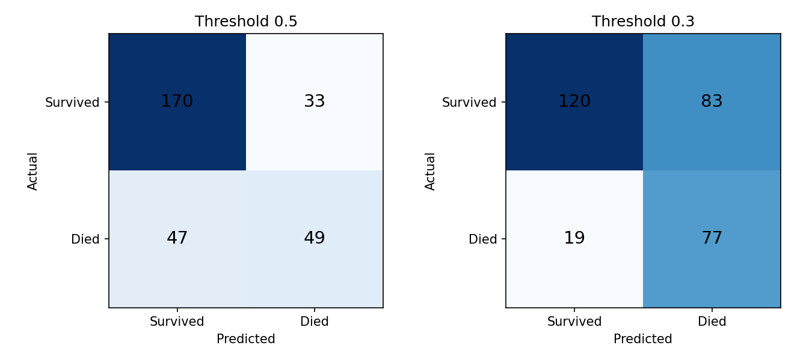
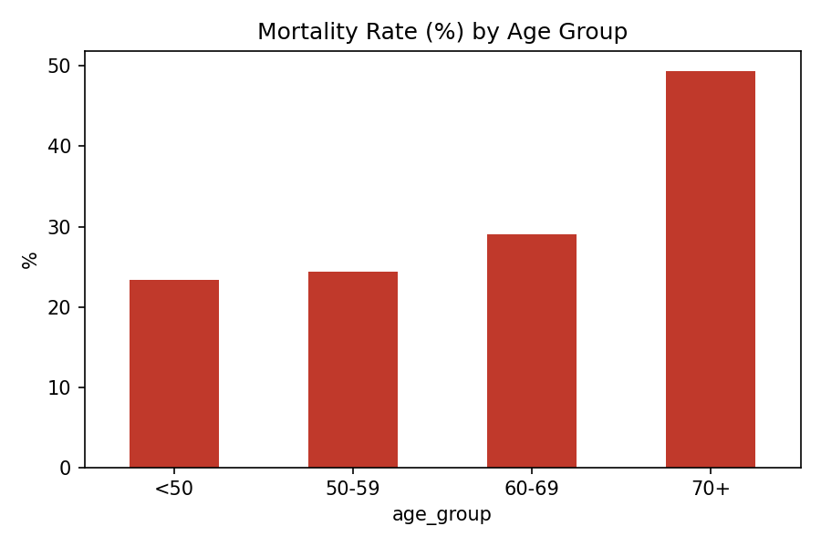
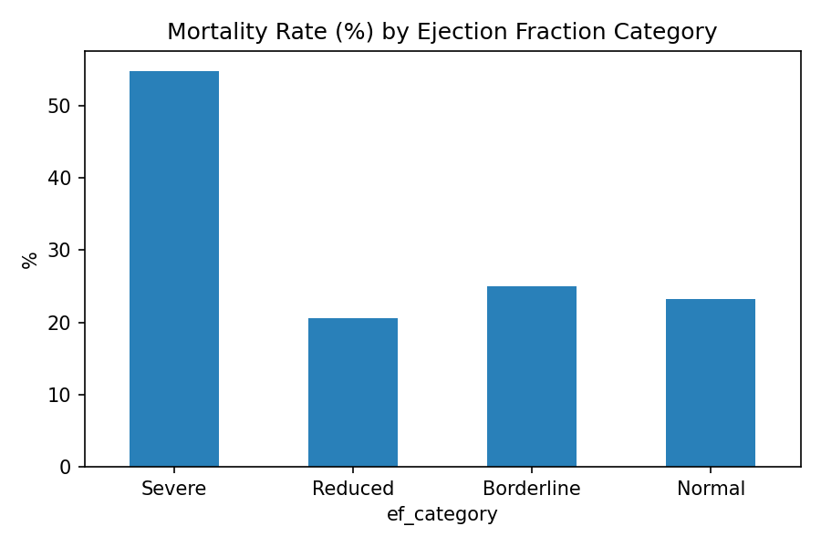

# Heart Failure Mortality Risk Analytics

End-to-end healthcare analytics project: data cleaning (pandas), SQL analysis (SQLite),
machine learning (scikit-learn), and a dashboard-ready dataset.

**Dataset:** [Heart Failure Clinical Records (Kaggle, andrewmvd)](https://www.kaggle.com/datasets/andrewmvd/heart-failure-clinical-data) - 299 patients, target `DEATH_EVENT`.

## Approach
1. **Cleaning (pandas):** duplicate and missing-value checks (0 found), IQR outlier capping, feature engineering (age groups, ejection-fraction categories, readable labels).
2. **SQL (SQLite):** 10 queries including window functions (`RANK()`, `AVG() OVER (PARTITION BY ...)`).
3. **ML:** Logistic Regression and Random Forest; `time` excluded to prevent data leakage.
4. **Risk scoring:** out-of-fold predicted probabilities (5-fold CV) so no patient is scored by a model trained on them.
5. **Threshold tuning:** chosen to prioritise recall.
6. **Dashboard:** built from `data/heart_failure_clean_with_predictions.csv`.

## Data quality
- Rows: 299 before and after cleaning
- Duplicates removed: 0
- Missing values: 0
- Outliers capped (IQR): creatinine_phosphokinase 29, serum_creatinine 29, platelets 21, serum_sodium 4, ejection_fraction 2

## Key insights
- Overall mortality rate: **32.1%**
- **Age:** mortality by age group (%): {'50-59': 24.4, '60-69': 29.0, '70+': 49.4, '<50': 23.4}
- **Ejection fraction:** mortality by category (%): {'Borderline': 25.0, 'Normal': 23.3, 'Reduced': 20.6, 'Severe': 54.8}
- **Serum creatinine:** patients who died averaged **1.84** vs **1.18** for survivors (raw data). After IQR capping: 1.48 vs 1.12. The direction holds, but capping shrinks the gap.
- **Highest-risk segment:** age 70+ with severe ejection fraction (75% mortality, at least 10 patients).

## Model results (80/20 test split)
| Model | Accuracy | Precision | Recall | F1 | ROC-AUC |
|---|---|---|---|---|---|
| Logistic Regression | 0.65 | 0.45 | 0.53 | 0.49 | 0.71 |
| Random Forest | 0.75 | 0.62 | 0.53 | 0.57 | 0.79 |

Random Forest 5-fold cross-validated ROC-AUC: 0.76

## Threshold tuning (out-of-fold predictions, all 299 patients)
Lowering the decision threshold from 0.50 to 0.30 raised recall from 0.51 to 0.80, at the cost of more false alarms (precision fell from 0.60 to 0.48). In clinical screening, missing a high-risk patient costs more than a false alarm.

|   Threshold |   Precision |   Recall |    F1 |
|------------:|------------:|---------:|------:|
|        0.1  |       0.328 |    1     | 0.494 |
|        0.15 |       0.347 |    0.969 | 0.511 |
|        0.2  |       0.383 |    0.906 | 0.539 |
|        0.25 |       0.432 |    0.854 | 0.573 |
|        0.3  |       0.487 |    0.792 | 0.603 |
|        0.35 |       0.538 |    0.729 | 0.619 |
|        0.4  |       0.578 |    0.656 | 0.615 |
|        0.45 |       0.579 |    0.573 | 0.576 |
|        0.5  |       0.593 |    0.5   | 0.542 |
|        0.55 |       0.625 |    0.417 | 0.5   |
|        0.6  |       0.659 |    0.302 | 0.414 |

## Dashboard

*(Add your dashboard screenshot here as `images/dashboard.png`.)*

## Limitations
- Small dataset (299 patients) from a single source, so results may not generalise.
- `time` (follow-up duration) was excluded because it leaks the outcome.
- Outliers were capped with the IQR rule. In clinical data extreme values can be real, so this is a modeling choice; raw averages are reported where they differ.
- The threshold was tuned on out-of-fold predictions from the same 299 patients and should be validated on external data before any real use.

## How to run
Open `notebook.ipynb` in Google Colab, upload `heart_failure_clinical_records_dataset.csv` from Kaggle, and run all cells.
